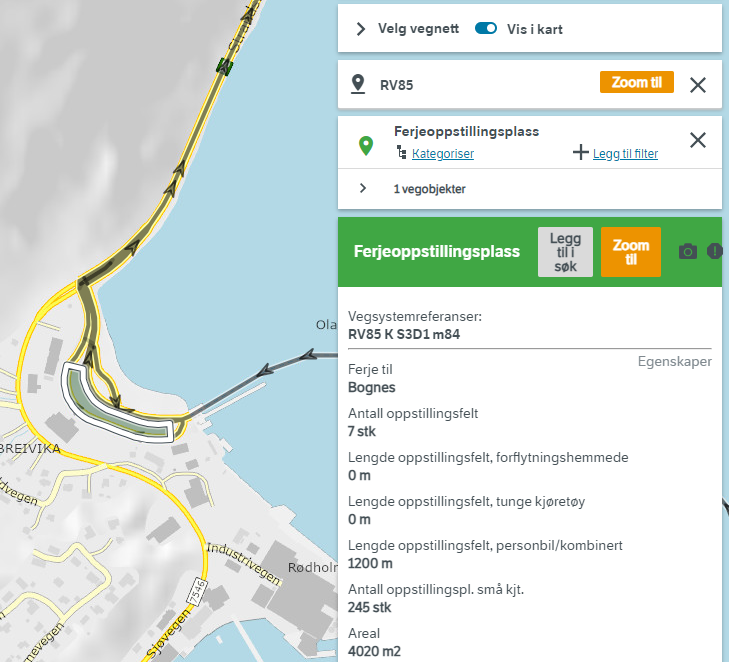
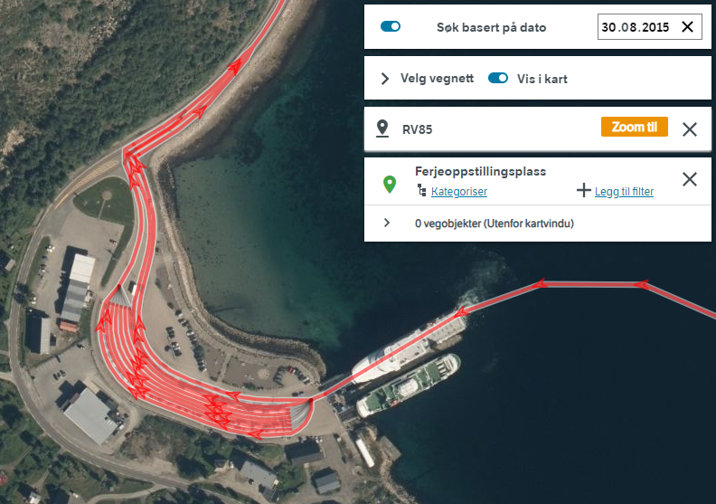

# Problemer og dilemma med datauttak etter Vianova-metode

  * **Bilferjer** er opplagt en del av operativ vegnett og ferjer på fylkesveg må jo opplagt håndteres budsjettmessig på en eller annen måte. Men er det riktig at ferje-vegnett skal behandles på samme måten som veger på land? Vi har cirka 1700 kilometer med bilferjer på fylkesvegnettet, skjevt fordelt på de fjordrike fylkene. 
  * **Feltlengde**
    * **Skal feltlengde også omfatte ferjestrekninger?** Feltlengde for bilferjer på fylkesveg utgjør cirka 3400 kilometer, igjen skjevt fordelt på fjordrike fylker (bilferje-vegnett har eksakt to kjørefelt, ett i hver retning).
    * **Skal feltlengde også omfatte sykkelfelt?** Lengden på feltlengde omfatter etter Vianova-metoden også _sykkelfelt_, er det riktig? Sykkelfelt skal vedlikeholdes og må i stor grad brøytes med spesialutstyr (f.eks roterende børster), så det er opplagt ekstrautgifter knyttet til dem. Men er det riktig modellering å inkludere dem tallmessig i parameteren _feltlengde_?
    * **Kjørefelt for parkering på ferjekai  forsvinner** NVDB har gått over fra å modellere oppstillingsplass på ferjekai som egne kjørefelt på vegnettet til en modell der objekttypen [41 Ferjeoppstillingsplass](https://datakatalogen.atlas.vegvesen.no/#/41/Ferjeoppstillingsplass) beskriver antall og lengde oppstillingsfelt for ulike kjøretøykategorier. Vegnettet er forenklet tilsvarende, og resultatet er lavere verdi for parameter _feltlengde_. Tallmessig betyr det ikke så mye, men dette er et eksempel på at Vianova-metodikken ikke er a jour med endringer i NVDB dataforvaltning. Generelt er det veldig uheldig at vi har metoder for datauttak som påvirkes av rent administrativ datapleie. For eksempel betyr denne endringen i vegnett på Lødingen ferjekai (mai 2022) at vi fikk en kilometer kortere _feltstrekning_ i Nordland fylke. 

Her er Lødingen ferjekai slik den er modellert i dag, med et objekt av typen 41 ferjeoppstillingsplass og et enklere vegnett [vegkart-søk](https://vegkart.atlas.vegvesen.no/#kartlag:geodata/@540701,7590108,14/hva:!(id~41)~/hvor:(vegsystemreferanse~!RV85)~/vegnett:metrering~+()~/valgt:728274016:41)

Her er Lødingen ferjekai modellert i 2015, uten ferjeoppstillingsplass-objekt, men med et mer komplisert vegnett og cirka en kilometer lengre verdi for _feltlengde_. Ferjeoppstillingsplasser er her modellert med kjørefelttypen O på vegnettet. [Vegkart-søk](https://vegkart.atlas.vegvesen.no/#kartlag:nib/@540733,7590055,15/vegnett:metrering~+()~/vegsystemreferanse:541194.761:7590049.972/n%C3%A5r:*2015-08-30~) 

  * **Konnekteringslenker**: Lengde vegnett og feltlengde – her pleier vi NVDB-fagfolk la være å telle konnekteringslenker, som er biten mellom vegkant og senterlinje i vegkryss, dvs den biten som «mangler» når en veg skal knyttes sammen med en annen. Disse utgjør erfaringsmessig cirka en halv prosent av lengden vegnettet. For fylkesveger utgjør konnekteringslenkene cirka 57 km. Vestland fylke har mest (8,2km), fulgt av nye Innlandet (7,5km). Ikke all verden betydning, men det hadde vært greit å være konsistent med f.eks KOSTRA-rapportering.
  * **Objektypen 616 Feltstrekning** er ikke lenger orginaldata for kjørefelt, men blir nå lagret på veglenkene i NVDB. Av hensyn til gamle klienter er objekttype 616 videreført, så joda – det vil for så vidt fungere å gjøre slik som foreslått. Men her burde metodikken vært oppdatert med modellendringer og endret dataforvaltning i NVDB: Det er enklere, mer robust og riktigere å analysere vegnettsdata direkte enn å hente vegnettsdata indirekte via objekttypen 616 Feltstrekning. 
    * For eksempel er det krevende å skille ut bilferjer og konnekteringslenker via den foreslåtte metoden på s36., mens det er enkelt hvis man maskinelt henter vegnettsdata direkte fra NVDB api. 
    * Vi kan ikke forutsette at objekttypen 616 har «evig liv». Tvert i mot vil den bli terminert når relevante fagsystem ikke lenger er avhengig av den.
  * **Adskilte løp = MOT**. En av spissfindighetene til NVDB er at veg med fysisk adskilte kjørebaner kan registreres på to ulike måter: Med en egen vegtrasé – lenke for hver av kjørebanene, eller med en felles vegtrasé midt i mellom. Hvis man ikke er oppmerksom risikerer man å «telle dobbelt» på de vegene der det finnes en vegtrasé registrert per kjøreretning (kjørebane). En av forbedringene introdusert i 2019 var at nettopp at vi får en robust mekanisme for å unngå slik dobbelttelling: Angjeldende veg har dataverdien adskilte løp = Med eller Mot. Nok et eksempel på en modellendringer som burde vært tatt med når man reviderte metodikken. 
    * Tallmessig har dette liten betydning for fylkesveg, vi har ca 12  km eller ca 20km med feltlengde på fylkesveg der vi har adskilte løp = Mot 
  * **Trafikkarbeid (millioner kjøretøykm)** Trafikkarbeid for en strekning regnes ut ved å multiplisere lengden av strekningen med ÅDT-verdien som er registrert på strekningen.  
    * ÅDT i NVDB er et statistisk estimat med en viss usikkerhet (registrert på objekttypen 540 Trafikkmengde)
    * Nye veger vil ofte mangle ÅDT-verdi: Det finnes jo ingen måleserie for den nye vegen (ennå), og dermed har man ikke datagrunnlag for ÅDT-beregning. Unntaksvis blir det lagt på estimerte ÅDT-tall basert på trafikktall for _"gamlevegen"_, men hovedregelen er at man **mangler data for trafikkmengde og dermed heller ikke kan regne trafikkarbeid for nye veger det året de åpner.** 
    * Vianova-datauttaket tar med data for alle _konnekteringslenker_ i beregning av trafikkarbeid. 
    * Bør trafikkarbeid på bilferje ha samme behandling som trafikkarbeid på veger på land? _Her er det ikke opplagt hva som er rett, men jeg synes det er rart at spørsmålet ikke er diskutert._
    * Trafikkmengde på adskilte løp er littegrann trøblete, fordi man ikke vet helt sikkert om trafikkmengden på det ene løpet er for begge retningene, eller om trafikkmengden er fordelt på hvert av løpene. 
      * Her har praksis endret seg; normalen i 2023 er at trafikkmengden er fordelt på de ulike løpene, men dette kan ikke garanteres for alle data. 
      * _Per definisjon er trafikkmengde et statistisk produkt for **begge retningene*, ikke en av dem, så dette er ikke så opplagt som man skulle tro_. 
      * Fra og med neste år vil produksjonen av trafikkmengde også legge på egenskapen _"Trafikkmengde på adskilte løp"_ med verdiene _"Sum av trafikk", "Trafikk i en retning"_ eller _"Ikke relevant"_. 
      * Når alle adskilte løp har trafikkmengde i én retning så blir produktet for trafikkarbeid korrekt såfremt man IKKE filtrerer vekk _Adskilte løp=Mot_.  
  * **Vegnett i NVDB for gående og syklende** NVDB vegnettsmodell er kraftig utvidet, med 10 av 17 veglenketyper som er forbeholdt gående og/eller syklende, for eksempel _gangveg, sykkelveg, trapp, sti_ og _fortau_, samt at vi har fått _sykkelfelt_ som kjørefelttype. 
    * **Sykkelfelt** langs bilveg inngår i opptellingen av _feltlengde_, er det riktig? 
    * **Tunnelløp for gående og syklende** inngår ikke i datauttaket eller økonomimodellen. I juni 2023 utgjorde dette 6 tunneller med samlet lengde på 878 meter. I juli åpnet _Fyllingsdalentunnel GS tunnel_, som er på ytterligere 3km. Dette er et komplisert tunnelanlegg med masse utstyr (lys, overvåkning m.m) og tilhørende driftsutgifter. Denne tunnelen har veglenketypen _Sykkelveg_, som ikke beskrevet på noen måte i noen av datauttaket, og heller ikke inngår i datauttaket _lengde gang/sykkelveg_ (som jo tar ut veglenketypen _Gang/sykkelveg_, ikke _Sykkelveg_). 
    * **Håndtering av nye veglenketyper** I varierende grad er det knyttet utgifter til vedlikehold av veglenketypene _Sykkelveg_, _Gangveg_, _Fortau_ og _Trapp_. Bør modellen justeres for dette? 
    * **Rekkverk langs gang- og sykkelsti** blir ikke tatt med i beregningsmodellen (filteret _trafikantgruppe = K_). Er dette riktig?  
  * **NVDB er ikke masterdata for bru og kai**. Fagdata om bruer og kaier blir forvaltet i fagsystemet Brutus, som maskinelt ajourholder objekttypen 60 Bru i NVDB parallelt med at fagpersoner jobber i Brutus. NVDB har på mange måter et forenklet datasett relativt til Brutus. Den Brutus-eksperten jeg jobber med mener et datauttak direkte fra Brutus hadde gitt et riktigere resultat, både for bru, ferjekai og tilleggskai, uten at jeg skal prøve å gjengi dette resonementet her. 
    * Personlig mener jeg at hvis man tar et aktivt valg om at kun NVDB skal være datakilde, ikke Brutus, så burde man gjort noen regneøvelser og tallfestet / kvalitetssikret at aktuelle valg med filtrering etc gir et riktigst mulig bilde. 
  * **Ferjekaibru og tilleggskai** På side 44 er en detaljert oppskrift som viser datauttak av objekttypen 60 Bru på fylkesveg, etterfulgt av filtrering på egenskapsverdiene brukategori=Ferjeleie og byggverkstype lik en av Ferjekaibru (810), Ferjekaibru (811), Ferjekaibru (812), Kai (820), Tilleggskai (822), Tilleggskai (823) eller Tilleggskai (824). 
    * Men hvorfor skal man ikke telle med varianten Tilleggskai (821) ? Er dette et bevisst valg, eller kan det være en forglemmelse? Jeg har spurt den Brutus-ekspert som trolig kjenner disse dataene best, og hun er uforstående til hvorfor Tilleggskai (821) ikke skal regnes med. (Hun har også et par andre kritiske spørsmål, men dem har jeg ikke kompetanse til å gjengi her). 
  * **Lengde Vegbru** Hvis ei vegbru går over en annen veg så er brua stedfestet til begge disse vegene i NVDB, dvs knyttet både til den vegen 
  som brua tilhører og den vegen som brua krysser over. I NVDB har vi ingen god metode for å skille disse tilfellene fra hverndre. 
    * Dette er grunnen til at fagmiljøet (NVDB og Brutus) foretrekker å bruke datauttak fra BRUTUS fremfor NVDB-data. 
  * **Rekkverk (løpemeter)** En utfordring med rekkverk er at noen av dem mangler verdi for egenskapen **Lengde**. For disse brukes lengden langs vegnettet. Her har Vianova-rapporten forstått logikken, men det er to svakheter
    * Da rapporten ble skrevet (2021) skulle man gjort filtrering på kolonnen _Filtreringshjelp = 1_ før man summerte verdiene for egenskapen _Lengde_. Grunnen er at mange rekkverk får flere oppføringer i tabellen når rekkverket passerer en endring i vegreferansen (ny delstrekning, for eksempel). Metodikken slik den er beskrevet ville dermed gitt dobbelttelling for radene med _filtreringshjelp=0_ når man summerer Lengde-egenskapen. _(Kolonnen filtreringshjelp forsvant fra V4-rapporten i 2023, sammen med de ekstra radene)_ 
    * Rapportens metode var derimot korrekt for å summere lengde langs vegnett for dem som manglet _Lengde_ - egenskap. 
    * I 2023 er problemet motsatt: Etter ønske fra brukerne har nå alle rekkverk kun én rad i V4-rapporten. Summering av Lengde-egenskap blir nå korrekt, mens summering av lengde langs vegnett vil være for liten dersom rekkverket har en utstrekning som gir endrede vegreferanse-verdier. (For eksempel hvis rekkverket starter på en delstrekning og slutter på en annen).  